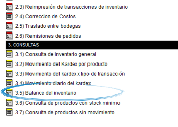

=====================
Balance de inventario
=====================

Introducción
------------
En el apartado de consultas *Balance de inventario* usted podrá visualizar información detallada acerca de los saldos en su centro de costos dado un periodo de tiempo.

Casos de uso
------------
Ud podrá remitirse a este informe para conocer:
 	- Las entradas y salidas de sus productos en un centro de costo y un periodo de tiempo específico.
 	- Saldos anteriores y actuales con respecto al valor de los productos que tuvieron movimiento.
 	- Información detallada relacionada a las transacciones del inventario por Línea y producto.

 .. figure:: images/12.png
   :align: center

  Así se visualizan los saldos en pantalla.

Filtros aplicables
------------------
Podrá filtrar la información por:

	- Centro de costo
	- Intervalo de fechas

Una vez elegidos los filtros principales y proceder con la consulta en el botón |btn_ok.bmp|, entonces aparecera un nuevo *filtro* que le permitirá ver en el listado de transacciones según la línea de su preferencia.

Opciones de salida
------------------
Usted podrá dar salida al reporte de *Balance de Inventario* en Los siguientes formatos:

	- |pdf_logo.gif| PDF 
	- |excel.bmp| Excel
	- |printer_q.bmp| Impresión

.. este comentario es solo para verificar si solo con el push recibes la actualización	

.. |pdf_logo.gif| image:: /_images/generales/pdf_logo.gif
.. |excel.bmp| image:: /_images/generales/excel.bmp
.. |codbar.png| image:: /_images/generales/codbar.png
.. |printer_q.bmp| image:: /_images/generales/printer_q.bmp
.. |calendaricon.gif| image:: /_images/generales/calendaricon.gif
.. |gear.bmp| image:: /_images/generales/gear.bmp
.. |openfolder.bmp| image:: /_images/generales/openfold.bmp
.. |library_listview.bmp| image:: /_images/generales/library_listview.png
.. |plus.bmp| image:: /_images/generales/plus.bmp
.. |wzedit.bmp| image:: /_images/generales/wzedit.bmp
.. |buscar.bmp| image:: /_images/generales/buscar.bmp
.. |delete.bmp| image:: /_images/generales/delete.bmp
.. |btn_ok.bmp| image:: /_images/generales/btn_ok.bmp
.. |refresh.bmp| image:: /_images/generales/refresh.bmp
.. |descartar.bmp| image:: /_images/generales/descartar.bmp
.. |save.bmp| image:: /_images/generales/save.bmp
.. |wznew.bmp| image:: /_images/generales/wznew.bmp