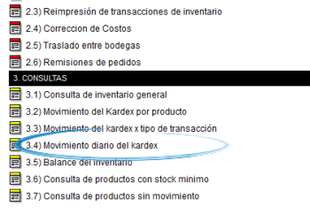
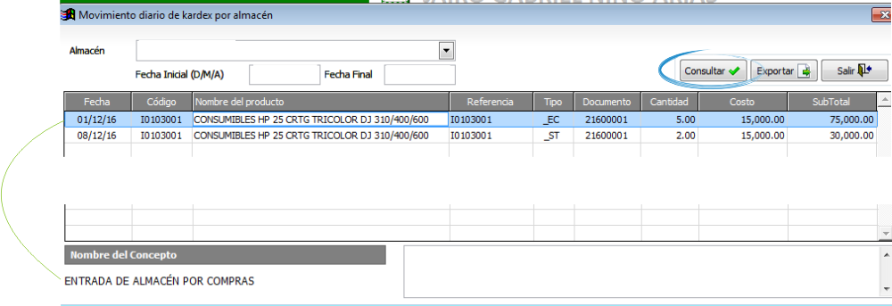

============================
Movimiento diario del kardex
============================

Ubicación
---------

:Módulo:
 Inventario

:Grupo:
 Parámetros

:Descripción:
  Movimiento diario del kardex

Introducción
------------

En este apartado de consultas usted podrá visualizar todas las operaciones transaccionales (Entradas, Salidas, Traslados, etc) de un centro de costo en un período de tiempo determinado.

Casos de uso
------------

Ud podrá remitirse a este informe para conocer:
	
	-Un listado de los productos que tuvieron movimiento en un periodo específico separados por día; Cada producto muestra su referencia, código, costo unitario, cantidad, Sub-total y el número de documento de la transacción.
	-Imprimir o descargar el movimiento diario del Kardex.

Filtros aplicables
------------------

Podrá filtrar la información por:
	
	- Centro de costo
	- Intervalo de fechas

Opciones de salida
------------------
Usted podrá dar salida al reporte de *Movimiento diario de Kardex por almacén* en Los siguientes formatos:

	- |pdf_logo.gif| PDF 
	- |excel.bmp| Excel
	- |printer_q.bmp| Impresión

.. |pdf_logo.gif| image:: /_images/generales/pdf_logo.gif
.. |excel.bmp| image:: /_images/generales/excel.bmp
.. |printer_q.bmp| image:: /_images/generales/printer_q.bmp
.. |calendaricon.gif| image:: /_images/generales/calendaricon.gif
.. |plus.bmp| image:: /_images/generales/plus.bmp
.. |wznew.bmp| image:: /_images/generales/wznew.bmp
.. |wzedit.bmp| image:: /_images/generales/wzedit.bmp
.. |buscar.bmp| image:: /_images/generales/buscar.bmp
.. |delete.bmp| image:: /_images/generales/delete.bmp
.. |btn_ok.bmp| image:: /_images/generales/btn_ok.bmp
.. |refresh.bmp| image:: /_images/generales/refresh.bmp
.. |descartar.bmp| image:: /_images/generales/descartar.bmp
.. |save.bmp| image:: /_images/generales/save.bmp