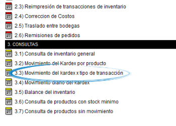

=============================================
Movimiento del kardex por tipo de transacción
=============================================

Ubicación
---------

:Módulo:
 Inventario

:Grupo:
 Consultas

:Descripción:
  Movimiento del kardex por tipo de transacción

Introducción
------------
En el apartado de consultas *Movimiento del Kardex por tipo de transacción* usted podrá visualizar un reporte de todas las operaciones transaccionales en un centro de costo específico de acuerdo a su tipo: entradas, salidas, traslados, etc.

Casos de Uso
------------

Ud podrá remitirse a este informe para conocer:

	-Un listado de los productos incluidos en el tipo de transacción seleccionado, en un periodo específico; Cada producto muestra su referencia, código, costo unitario, cantidad y el número de documento de la transacción.

Filtros aplicables
------------------

Podrá filtrar la información por:

	- Centro de costo
	- Intervalo de fechas
	- Tipo de transacción

En esta cabezera puede aplicar los filtros que necesite. 

Una vez elegidos los filtros principales y proceder con la consulta en el botón |btn_ok.bmp|, entonces aparecera un nuevo *filtro* que le permitirá ver en el listado de transacciones, las que involucren a un producto en específico.

 .. figure:: images/8.png
      :align: center

Opciones de salida
------------------
Usted podrá dar salida al reporte de *Movimiento de Kardex por tipo de transacción* en Los siguientes formatos:

	- |pdf_logo.gif| PDF 
	- |excel.bmp| Excel
		- Informe Plano
		- Informe agrupado por concepto
	- |printer_q.bmp| Impresión

.. |pdf_logo.gif| image:: /_images/generales/pdf_logo.gif
.. |excel.bmp| image:: /_images/generales/excel.bmp
.. |printer_q.bmp| image:: /_images/generales/printer_q.bmp
.. |calendaricon.gif| image:: /_images/generales/calendaricon.gif
.. |plus.bmp| image:: /_images/generales/plus.bmp
.. |wznew.bmp| image:: /_images/generales/wznew.bmp
.. |wzedit.bmp| image:: /_images/generales/wzedit.bmp
.. |buscar.bmp| image:: /_images/generales/buscar.bmp
.. |delete.bmp| image:: /_images/generales/delete.bmp
.. |btn_ok.bmp| image:: /_images/generales/btn_ok.bmp
.. |refresh.bmp| image:: /_images/generales/refresh.bmp
.. |descartar.bmp| image:: /_images/generales/descartar.bmp
.. |save.bmp| image:: /_images/generales/save.bmp