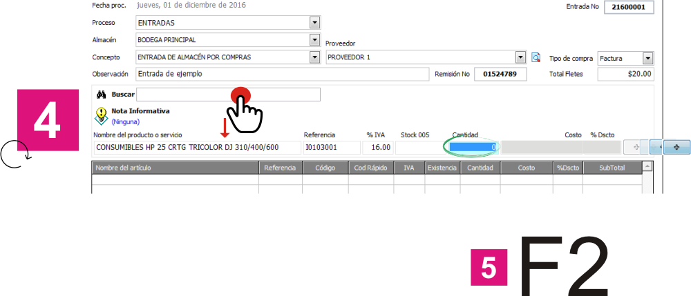

==================================================
Entradas, salidas & transferencias de mercancías
==================================================

Ubicación
=========

:Módulo:
 Inventario

:Grupo:
 Procesos

:Descripción:
 Entradas, salidas y transferencia de mercancías

Introducción
============

En la opción *Entradas, salidas & transferencias de mercancías* usted podrá manejar la ubicación, la entrada o la salida de los insumos o productos que actualmente están registrados en el sistema.

La opción *Entradas, salidas & transferencias de mercancías* le permitirá entre otras cosas.

 - Dar entrada a productos al inventario
 - Dar salida a productos del inventario
 - Trasladar productos de un centro de costo a otro.

Entradas de mercancías
======================

Introducción
------------

La entrada de mercancía es un proceso de inventario que le permitirá registrar en el sistema, todo aquel producto que llegue al centro de costo, sea cual sea la razón de su llegada, a continuación podrá leer sobre los tipos de entradas existentes.

 .. NOTE::

   En *Generalidades del Módulo de Inventario - Definición de Transacciones de Inventario* Aprendió a crear nuevos tipos de entradas que ahora aparecerán a la hora de ingresar mercancía.

Tipos de entradas
-----------------

Existen dos formas principales en que la mercancía puede entrar al sistema de inventario:

 - Entradas de almacén por compras (Ingreso de facturas de compra a proveedores)
 - Entradas por otros conceptos (Conceptos definidos por el usuario, ej: entrada por obsequio, etc ...)

Entradas de almacén por compras
-------------------------------
Pre-requisitos
^^^^^^^^^^^^^^

Para poder realizar una entrada de almacén por compras, tenga en cuenta que :
  .. se puede hacer referencia a la creación de un centro de costo, creación de proveedor y vinculo a la explicación de la conf del centro en cuantro a compras ref
 - Debe existir por lo menos un centro de costo.
 - Debe haber creado el proveedor al cual va a realizarle la compra.
 - Debe habilitar el centro de costo para realizar compras.

Cualquier entrada a inventario deberá tener un *número de remisión* que puede ser una factura de compra, un número de remisión, un documento soporte, etc...

Para realizar entradas por compras
^^^^^^^^^^^^^^^^^^^^^^^^^^^^^^^^^^

Usted realizará la operación *Entrada de almacén por compras* cuando los productos que desea ingresar han sido comprados por la empresa a un proveedor específico y cuenta con un documento de soporte como una factura o una remisión.

Para realizar una *Entrada de almacén por compras* siga los siguientes pasos:

 - Ejecute la opción *Entradas, salidas & transferencias de mercancías*
 - El sistema desplegará una ventana donde encontrará una lista de opciones con la pregunta *¿Qué proceso desea realizar?*

            .. figure:: images/1.png
              :align: center

 - Escoja el proceso *Entradas*
 - Escoja el *Centro de costo* donde ingresará la mercancía
 - Seleccione el concepto *Entrada de almacén por compras*
 - Usted verá como aparecen dos nuevos campos en pantalla: Proveedor y tipo de compra.
 - Seleccione el Proveedor al cual se le ha comprado la mercancía entrante.
 - Seleccione el tipo de compra. Existen dos tipos de compra:

      - Factura: Se habla de factura cuando los productos deben incluir algún tipo de impuesto.
      - Remisión: Use esta opción para realizar una entrada de mercancía que no reflejará impuesto alguno.
 - Agregue alguna observación apropiada para describir este proceso de entrada.
 - Especifique el *Remisión No* - Puede indicar aquí cualquier control pertinente indicado en el documento físico de la factura o la remisión.
 - Puede introducir un monto para los fletes que será distribuido entre el costo de los insumos de la compra.

            .. figure:: images/2.png
               :align: center

    .. se puede hacer referencia a quien es el admin del sistema ref
	 .. NOTE::
	   Esta opción viene deshabilitada por defecto. Para activarla comuníquese con el administrador de sistema.

 - Encontrará ahora la casilla |buscar.bmp| buscar, donde podrá dar inicio a la inserción de productos. Si sabe el código del producto digítelo, ingréselo con el lector láser, o también, situado sobre la casilla, oprima Enter para abrir la lista de productos y buscarlo. Oprima enter si ya lo ha encontrado o ha digitado el código.
 - Verá como aparece información relacionada al producto:

    +------+----------+----+-----+--------+-----+---------+----------+
    |Nombre|referencia|IVA%|Stock|cantidad|costo|descuento||plus.bmp||
    +------+----------+----+-----+--------+-----+---------+----------+

 - En el campo *cantidad* introduzca la cantidad de productos que han llegado al centro de costo. Presione Enter para confirmar.
 - En el campo *costo* ingrese el precio del producto que aparece en la factura (sin IVA). Presione Enter para confirmar.
 - En el campo *descuento* ingrese el porcentaje del descuento en caso de ser necesario. Presione Enter para confirmar.
 - Presione Enter de Nuevo o haga click en |plus.bmp| para agregar el producto a la lista.
 - Una vez el producto aparezca en la lista, podrá ingresar otro producto presionando Enter.
 - Si no hay más productos para agregar, revise que el listado, los costos, IVA, fletes y descuentos sean correctos y presione F2 o el ícono |save.bmp| *Guardar*.
  - El sistema pedirá que confirme el procedimiento, seleccione *sí*.

  .. figure:: images/3.png
      :align: center

  - Visualizará en un documento un comprobante de ingreso de mercancía por compra a proveedor. Puede imprimirlo para respaldo físico. Podrá reimprimir este comprobante en la opción *reimpresión de transacciones de inventario* de este mismo apartado.

	 .. NOTE::
	   El campo IVA sólo estará presente en la opción *Entrada de almacén por compras* y además si está permitido en las características del producto.

Entradas por otros conceptos
----------------------------

Las entradas de almacén por conceptos, le permiten al usuario personalizar las operaciones de inventario, marcandolas con un concepto especifico.
Esto es de gran utilidad cuando nos interesa tener informes períodicos donde podamos analizar que tipo de operaciones se están realizando en el inventario.

Algunas de las entradas por conceptos que pueden existir son:

 - Saldos iniciales de inventarios: Use este concepto de entrada cuando está abriendo el centro de costo contable y administrativamente y tiene un inventario inicial.
 - Entrada de almacén por ajuste débito: Use este concepto de entrada para fines diversos.
 - Entrada de almacén por obsequio: Use este concepto cuando recibe obsequios de sus proveedores.

Pre-requisitos
^^^^^^^^^^^^^^

.. se puede hacer referencia
Para poder realizar entradas de almacén por conceptos, tenga en cuenta que:

- Debe existir por lo menos un centro de costo.
- Debe existir por lo menos un concepto de entrada creado.

Para realizar entradas por otros conceptos
^^^^^^^^^^^^^^^^^^^^^^^^^^^^^^^^^^^^^^^^^^

Para realizar una *Entrada* de almacén por conceptos, siga los siguientes pasos:

 - Ejecute la opción *Entradas, salidas & transferencias de mercancías*
 - El sistema desplegará una ventana donde encontrará una lista de opciones con la pregunta *¿Qué proceso desea realizar?*

            .. figure:: images/1.png
              :align: center

 - Escoja el proceso *Entradas*
 - Escoja el *Centro de costo* donde ingresará la mercancía
 - Seleccione el concepto apropiado
 - Agregue alguna observación apropiada para describir este proceso de entrada.
 - Especifique el *Remisión No* - Puede indicar aquí cualquier control pertinente indicado en el documento físico de la factura o la remisión.
 - Puede introducir un monto para los fletes que será distribuido entre el costo de los productos de la compra.
   
 .. figure:: images/4.png
      :align: center

	 .. NOTE::
        Esta opción viene deshabilitada por defecto. Para activarla comuníquese con el administrador de sistema.

 - Encontrará ahora la casilla |buscar.bmp| *buscar*, donde podrá dar inicio a la inserción de productos que desea dar entrada al inventario. Si sabe el código del producto digítelo, ingréselo con el lector láser, o también, situado sobre la casilla, oprima Enter para abrir la lista de productos y buscarlo. Oprima enter si ya lo ha encontrado o ha digitado el código.
 - Verá como aparece información relacionada al producto:

    +------+----------+----+-----+--------+-----+---------+----------+
    |Nombre|referencia|IVA%|Stock|cantidad|costo|descuento||plus.bmp||
    +------+----------+----+-----+--------+-----+---------+----------+

 - En el campo *cantidad* introduzca la cantidad de productos que han llegado al centro de costo. Presione Enter para confirmar.
 - En el campo *costo* ingrese el precio del producto que aparece en la remisión. Presione Enter para confirmar.
 - En el campo *descuento* ingrese el monto del descuento en caso de ser necesario. Presione Enter para confirmar.
 - Presione Enter de Nuevo o haga click en |plus.bmp| para agregar el producto a la lista.
 - Una vez el producto aparezca en la lista, podrá ingresar otro producto presionando Enter.
 - Si no hay más productos para agregar, revise que el listado, los costos, fletes y descuentos sean correctos y presione F2 o el ícono |save.bmp| *Guardar*.
 - El sistema pedirá que confirme el procedimiento, seleccione *sí*.
 - Visualizará un comprobante de entrada. Puede imprimirlo para respaldo físico. Podrá reimprimir este comprobante en la opción *reimpresión de transacciones de inventario* de este mismo apartado.

 .. figure:: images/7.png
      :align: center

Fletes
------

El campo flete en las entradas de mercancía de cualquier tipo, afecta el costo total de la factura y de cada producto, distribuyendo el flete entre cada uno de los productos ingresados. Esto podrá observarlo al generar el comprobante.

Salidas de mercancias
=====================

Introducción
------------

Las *salidas de mercancías* son una operación de inventario para el registro de toda salida de un producto del centro de costo. Esta salida puede darse por un concepto predefinido por el usuario o por un proceso administrativo del sistema, tal como: Factura de venta, devolución al proveedor, etc...

 .. NOTE::
   En *Generalidades del Módulo de Inventario - Definición de Transacciones de Inventario* Aprendió a crear nuevos tipos de salidas que ahora aparecerán a la hora de dar salida a la mercancía.

Para realizar salidas de mercancías por conceptos
-------------------------------------------------

Para dar salida a un producto o conjunto de productos del centro de costo, siga los siguientes pasos:

 - Ejecute la opción *Entradas, salidas & transferencias de mercancías*
 - El sistema desplegará una ventana donde encontrará una lista de opciones con la pregunta *¿Qué proceso desea realizar?*

            .. figure:: images/1.png
              :align: center

 - Escoja el proceso *Salidas*
 - Escoja el *Centro de costo* de donde saldrá la mercancía
 - Seleccione el concepto apropiado
 - Agregue alguna observación apropiada para describir este proceso de salida.

    .. figure:: images/5.png
        :align: center

 - Encontrará ahora la casilla |buscar.bmp| *buscar*, donde podrá dar inicio a la inserción de productos a los que dará salida. Si sabe el código del producto digítelo, ingréselo con el lector láser, o también, situado sobre la casilla, oprima Enter para abrir la lista de productos y buscarlo. Oprima enter si ya lo ha encontrado o ha digitado el código.
 - Verá como aparece información relacionada al producto:

    +------+----------+----+-----+--------+-----+---------+----------+
    |Nombre|referencia|IVA%|Stock|cantidad|costo|descuento||plus.bmp||
    +------+----------+----+-----+--------+-----+---------+----------+

 - En el campo *cantidad* introduzca la cantidad de productos que saldrán del centro de costo. Presione Enter para confirmar.

     .. Note::
     En el caso de una salida de mercancía del centro de costo por este medio, no se podrá especificar: descuento, IVA, flete ni costo.
     
 - Presione Enter de Nuevo o haga click en |plus.bmp| para agregar el producto a la lista.
 - Una vez el producto aparezca en la lista, podrá ingresar otro producto presionando Enter.
 - Si no hay más productos para agregar, revise que el listado sea el correcto y presione F2 o el ícono |save.bmp| *guardar*.
 - El sistema pedirá que confirme el procedimiento, seleccione *sí*.
 - Visualizará un comprobante de salida. Puede imprimirlo para respaldo físico.

      .. Note::

      Podrá reimprimir este comprobante en la opción *Reimpresión de transacciones de inventario* de este mismo apartado.

Transferencias de mercancías
============================
Introducción
------------
*Traslado entre bodegas* es una operación de inventario que permite envíar mercancía de un centro de costo a otro. De esta manera puede intercambiar productos en sus centros de costo y siempre mantenerlos actualizados.

Pre-requisitos
--------------
 Para realizar un *traslado entre bodegas* primero deberá:
 - Tener al menos dos centros de costos creados.
 - Poseer existencias de productos en el centro de costo origen.
 - Tener los permisos correspondientes. Si no los tiene, comuníquese con su administrador de sistema.

Para realizar Transferencias de mercancías
------------------------------------------

Para realizar una transferencia de mercancías, siga estos pasos:

 - Ejecute la opción *Entradas, salidas & transferencias de mercancías*
 - El sistema desplegará una ventana donde encontrará una lista de opciones con la pregunta *¿Qué proceso desea realizar?*.

            .. figure:: images/1.png
              :align: center

 - Escoja el proceso *Traslado entre bodegas*.
 - Escoja el *centro de costo* de donde saldrá la mercancía.
 - Escoja el *centro de costo* a donde llegará la mercancía.
 - Escriba una observación de ser necesario.
 - Encontrará ahora la casilla |buscar.bmp| *buscar*, donde podrá dar inicio a la inserción de productos a los que quiere dar salida. Si sabe el código del producto digítelo, ingréselo con el lector láser, o también oprima Enter y búsquelo en la lista de productos. Oprima enter de nuevo.

     .. figure:: images/8.png
       :align: center

 - Encontrará ahora la casilla |buscar.bmp| *buscar*, donde podrá dar inicio a la inserción de productos a los que quiere dar salida. Si sabe el código del producto digítelo, ingréselo con el lector láser, o también, situado sobre la casilla, oprima Enter para abrir la lista de productos y buscarlo. Oprima enter si ya lo ha encontrado o ha digitado el código.
 - Verá como aparece información relacionada al producto:

    +------+----------+----+-----+--------+-----+---------+-----------+
    |Nombre|referencia|IVA%|Stock|cantidad|costo|descuento| |plus.bmp||
    +------+----------+----+-----+--------+-----+---------+-----------+
    
 - En el campo *cantidad* introduzca la cantidad de productos de este tipo que saldrán del centro de costo. Presione Enter para confirmar.

     .. Note::
     En el caso de un traslado entre centros de costo, no se podrá especificar: descuento, IVA, flete ni costo. Solo la cantidad.

 - Presione Enter de Nuevo o el ícono |plus.bmp| para agregar el producto a la lista.
 - Una vez el producto aparezca en la lista, podrá ingresar otro producto presionando Enter.
 - Si no hay más productos para agregar, revise que el listado sea el correcto y presione F2 o el ícono |save.bmp| *Guardar*.
 - El sistema pedirá que confirme el procedimiento, seleccione *Sí*.
 - Visualizará un comprobante de salida. Puede imprimirlo para respaldo físico.
 - Ahora podrá consultar ambas bodegas y ver los cambios en las cantidades de producto. Para consultar, consulte en el manual acerca de este mismo módulo en el apartado *consultas*.

  	 .. Note::
     Podrá reimprimir este comprobante en la opción *Reimpresión de transacciones de inventario* de este mismo apartado.

 .. figure:: images/9.png
   :align: center

Ordenes de compra
=================
Introducción
------------

La orden de compra es un proceso mediante el cual usted puede hacer un pedido detallado al proveedor. Puede registrar estas ordenes en el sistema y luego comparar con el pedido que llega.

Pre-requisitos
--------------

Para poder realizar ordenes de compra, tenga en cuenta que:
  .. se puede hacer referencia
 - Debe existir por lo menos un centro de costo.
 - Debe haber creado el proveedor al cual le realizará el pedido.
 - Habilitar el centro de costo para realizar por compras.

Para crear orden de compra
--------------------------
Para realizar una *Orden de compra* en el sistema siga los siguientes pasos:

 - Ejecute la opción *Entradas, salidas & transferencias de mercancías*.
 - El sistema desplegará una ventana donde encontrará una lista de opciones con la pregunta *¿Qué proceso desea realizar?*.

              .. figure:: images/1.png
                :align: center

 - Escoja el proceso *Orden de compra*.
 - Escoja el *centro de costo* donde ingresará la mercancía una vez el proveedor la envíe.
 - Usted verá como aparecen dos nuevos campos en pantalla: Proveedor y tipo de compra.
 -Seleccione el Proveedor al cual se le comprará la mercancía entrante.
 -Seleccione el tipo de orden de compra. Existen dos tipos orden de compra:
    - Factura: Se habla de factura cuando los productos deben incluir algún tipo de impuesto.
    - Remisión: Use esta opción para realizar una orden de compra que no reflejará impuesto alguno.
 - Agregue alguna observación apropiada para describir este proceso de entrada.
 - Puede introducir un monto para los fletes que será distribuido entre el costo de los productos de la compra.
     .. se puede hacer referencia
  	 .. Note::
  		Esta opción viene deshabilitada por defecto. Para activarla comuníquese con el administrador de sistema.

 .. figure:: images/10.png
    :align: center

 - Encontrará ahora la casilla |buscar.bmp| buscar, donde podrá dar inicio a la inserción de productos. Si sabe el código del producto digítelo, ingréselo con el lector láser, o también, situado sobre la casilla, oprima Enter para abrir la lista de productos y buscarlo. Oprima enter si ya lo ha encontrado o ha digitado el código..
 - Verá como aparece información relacionada al producto:

      +------+----------+----+-----+--------+-----+---------+----------+
      |Nombre|referencia|IVA%|Stock|cantidad|costo|descuento||plus.bmp||
      +------+----------+----+-----+--------+-----+---------+----------+

 - En el campo *cantidad* introduzca la cantidad de productos de este tipo que pedirá al proveedor. Presione Enter para confirmar.
 - En el campo *costo* ingrese el costo del producto que aparece en la remisión. Presione Enter para confirmar.
 - Presione Enter de Nuevo o haga click en |plus.bmp| para agregar el producto a la lista.
 - Una vez el producto aparezca en la lista, podrá ingresar otro producto presionando Enter.
 - Si no hay más productos para agregar, revise que el listado, los costos y fletes sean correctos y presione F2 o el ícono |save.bmp| *guardar*.
 - El sistema pedirá que confirme el procedimiento, seleccione *sí*.
 - Visualizará un comprobante de orden de compra. Puede imprimirlo para respaldo físico.

 	 .. Note::
   	   Podrá reimprimir este comprobante en la opción *Reimpresión de transacciones de inventario* de este mismo apartado.

 .. figure:: images/11.png
       :align: center

Eliminar orden de compra
------------------------

Para eliminar una orden de compra siga estos pasos:

 - Ejecute la opción *Entradas, salidas & transferencias de mercancías*.
 - Pulse el botón *Ingreso de mercancías por orden de compra*.
 - Seleccione en la lista "Almacen" el centro de costo correspondiente.
 - Elija en la lista "Proveedor" el proveedor adjudicado a la orden de compra.
 - En la lista de la derecha donde puede seleccionar la orden de compra, seleccione la que desea eliminar y presione la tecla 'Supr' o 'Delete'.
 - Vera un mensaje de confirmación donde deberá pulsar *Sí* si está seguro de eliminarla.

Entrada de mercancías por medio de orden de compra existente
============================================================

Introducción
------------

Puede realizar una operación de *entrada de mercancía* a partir de una *orden de compra* hecha anterioremente. No tendrá que digitar los productos de nuevo sino, más bien, verificar la cantidad de productos que entrarán con respecto a la orden que realizó.

 .. figure:: images/12.png
       :align: center

Pre-requisitos
--------------

Para poder realizar *Entrada de mercancías* basado en una orden de compra prevía, tenga en cuenta que:

 .. se puede hacer referencia
  - Debe haber creado una **orden de compra** con anterioridad.

Para crear una entrada de mercancías por medio de orden de compra existente
---------------------------------------------------------------------------

Para realizar una *Entrada de mercancía* por orden de compra al sistema siga los siguientes pasos:

 - Ejecute la opción *Entradas, salidas & transferencias de mercancías*
 - Pulse el botón *Ingreso de mercancías por orden de compra*

            .. figure:: images/13.png
                :align: center

 - Aparecerá una ventana flotante donde deberá seleccionar primeramente el centro de costo al que ingresará la mercancía.
 - Seleccione el proveedor al que realizó con anterioridad la orden de compra.
 - Verá aparecer una lista desplegable a la derecha donde podrá seleccionar la *orden de compra* a la que quiere dar entrada.
 - Cuando seleccione la *orden de compra* entonces verá en la lista de abajo todos los productos que aparecían en la orden.
 - Haga check en los productos que llegaron a su centro de costo.
 - Podrá modificar el campo *recibir* puede escribir la cantidad del producto que llegó realmente.
 - Pulse aceptar cuando haya seleccionado los productos y las cantidades correctas.
 - Agregue alguna observación apropiada para describir este proceso de entrada de mercancía por orden de compra.
 - Especifique el *Remisión No* - Puede indicar aquí cualquier control pertinente indicado en el documento físico de la factura o la remisión.
 - Puede introducir un monto para los fletes que será distribuido entre el costo de los insumos de la compra.
      .. se puede hacer referencia
   	 .. Note::
   	    Esta opción viene deshabilitada por defecto. Para activarla comuníquese con el administrador de sistema.

 - Verá como aparece información relacionada a cada producto en la lista.
 - En la columna *costo* ingrese el precio del producto que aparece en la factura (sin IVA).
 - En la columna *descuento* ingrese el porcentaje del descuento en caso de ser necesario.
 - Revise que el listado, los costos, IVA, fletes y descuentos sean correctos y presione F2 o el ícono |save.bmp| *Guardar*.
 - El sistema pedirá que confirme el procedimiento, seleccione *sí*.
 - Visualizará en un documento un comprobante de ingreso de mercancía por compra a proveedor. Puede imprimirlo para respaldo físico. Podrá reimprimir este comprobante en la opción *reimpresión de transacciones de inventario* de este mismo apartado.

 .. figure:: images/14.png
       :align: center

.. |plus.bmp| image:: /_images/generales/plus.bmp
.. |wznew.bmp| image:: /_images/generales/wznew.bmp
.. |wzedit.bmp| image:: /_images/generales/wzedit.bmp
.. |buscar.bmp| image:: /_images/generales/buscar.bmp
.. |delete.bmp| image:: /_images/generales/delete.bmp
.. |btn_ok.bmp| image:: /_images/generales/btn_ok.bmp
.. |refresh.bmp| image:: /_images/generales/refresh.bmp
.. |descartar.bmp| image:: /_images/generales/descartar.bmp
.. |save.bmp| image:: /_images/generales/save.bmp
